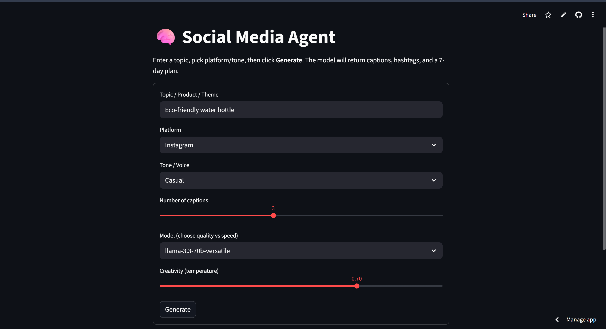
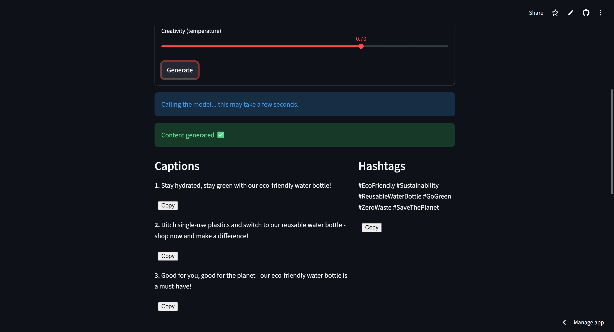
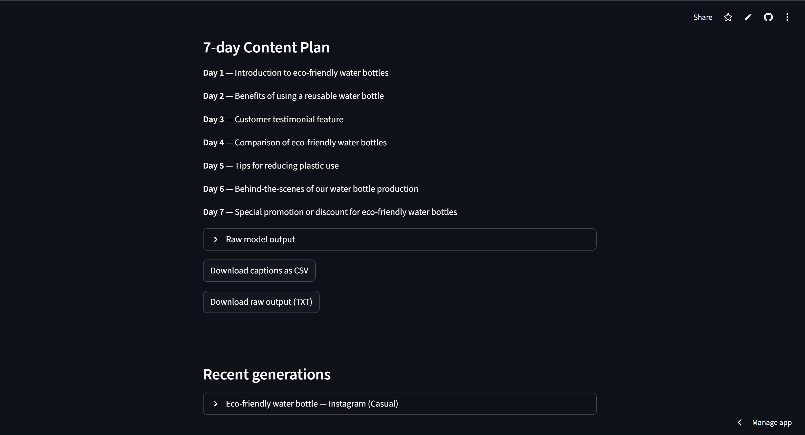
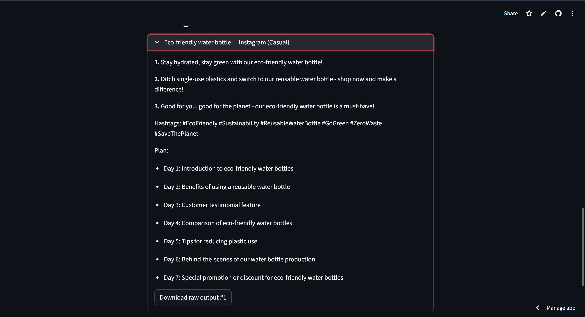

# 🌟 Social Media Agent — Groq + Streamlit

An intelligent and lightweight **AI-powered Social Media Content Generator** that creates:
- Engaging captions  
- Relevant hashtags  
- A complete 7-day content plan  

All powered by **Groq’s FREE Llama models** and built using **Streamlit**.

This app is ideal for students, creators, marketers, and businesses who want fast, high-quality content.

---

## 🌐 Live Demo
👉 **Deployed App:**  
https://harshithashankar-git-social-media-agent-app-wrqla6.streamlit.app/

---

## 🖼️ Screenshots

### 🏠 Home Screen


---

### ✨ Generated Output — Sample 1


---

### ✨ Generated Output — Sample 2


---

### ✨ Generated Output — Sample 3


---

## 🚀 Features
- Generate **any number** of social media captions (via slider)
- 6 relevant hashtags (auto-generated)
- AI-created 7-day content plan
- Copy-to-clipboard buttons
- Download captions as **CSV**
- Download raw model output as **TXT**
- Recent generations stored within the session
- Clean UI designed for fast iteration

---

## 🧠 Tech Stack
- **Python 3.11.9**
- **Streamlit**
- **Groq Python SDK**
- **pandas**

---

## 🛠️ Local Setup & Run (Windows PowerShell)

### 1️⃣ Clone the repository
```powershell
git clone https://github.com/HarshithaShankar-git/social-media-agent.git
cd social-media-agent
